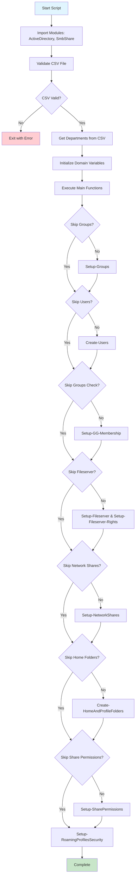
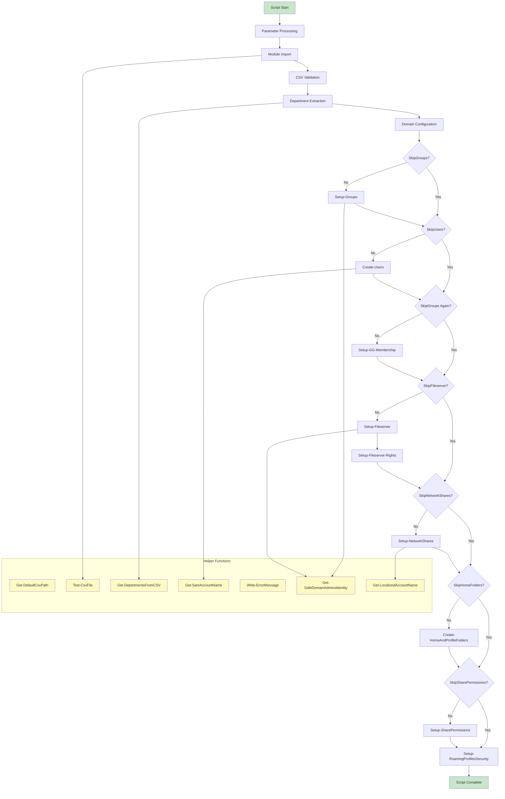
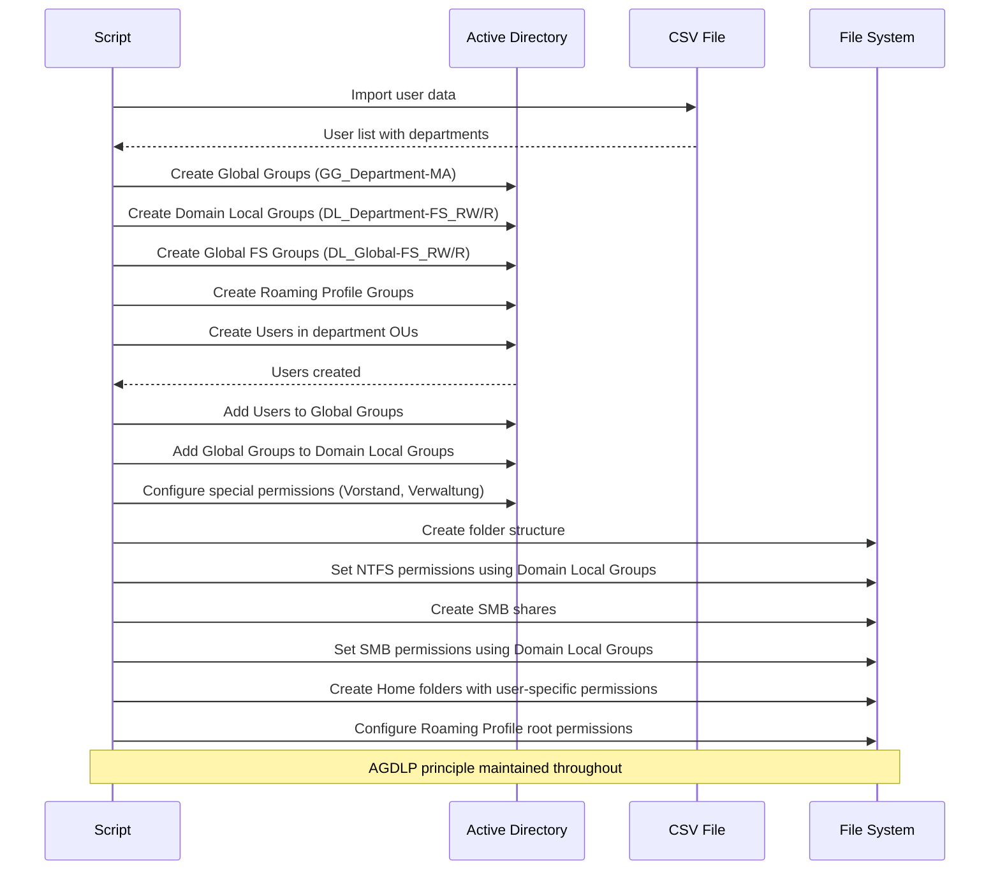
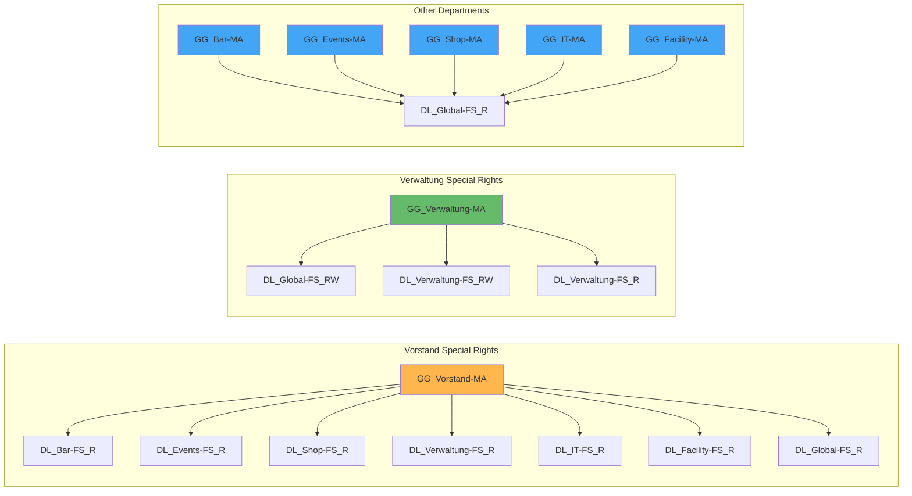

# PowerShell Fileserver Setup Script - Mermaid Documentation

## Script Overview
This documentation provides a comprehensive visual representation of the PowerShell script `ImportCSV.ps1` which implements a complete fileserver setup following the AGDLP (Accounts, Global Groups, Domain Local Groups, Permissions) principle.

## 1. Script Execution Flow



## 2. AGDLP Structure Implementation

```mermaid
graph TB
    subgraph "Accounts (A)"
        U1[jan.janssen<br/>Vorstand]
        U2[marco.peters<br/>Bar]
        U3[christine.bauer<br/>Events]
        U4[anna.gebhardt<br/>Shop]
        U5[julia.schneider<br/>Verwaltung]
        U6[frank.bittner<br/>IT]
        U7[mark.born<br/>Facility]
        U8[gast1.nutzer1<br/>Gast]
    end
    
    subgraph "Global Groups (G)"
        GG1[GG_Vorstand-MA]
        GG2[GG_Bar-MA]
        GG3[GG_Events-MA]
        GG4[GG_Shop-MA]
        GG5[GG_Verwaltung-MA]
        GG6[GG_IT-MA]
        GG7[GG_Facility-MA]
        GG8[GG_Gast-MA]
        GG9[GG_RoamingProfileUsers]
    end
    
    subgraph "Domain Local Groups (DL)"
        DL1[DL_Vorstand-FS_RW]
        DL2[DL_Vorstand-FS_R]
        DL3[DL_Bar-FS_RW]
        DL4[DL_Bar-FS_R]
        DL5[DL_Events-FS_RW]
        DL6[DL_Events-FS_R]
        DL7[DL_Shop-FS_RW]
        DL8[DL_Shop-FS_R]
        DL9[DL_Verwaltung-FS_RW]
        DL10[DL_Verwaltung-FS_R]
        DL11[DL_IT-FS_RW]
        DL12[DL_IT-FS_R]
        DL13[DL_Facility-FS_RW]
        DL14[DL_Facility-FS_R]
        DL15[DL_Global-FS_RW]
        DL16[DL_Global-FS_R]
        DL17[DL_RoamingProfileUsers]
    end
    
    subgraph "Permissions (P)"
        P1[NTFS: Vorstand Folder<br/>RW/R Access]
        P2[NTFS: Bar Folder<br/>RW/R Access]
        P3[NTFS: Events Folder<br/>RW/R Access]
        P4[NTFS: Shop Folder<br/>RW/R Access]
        P5[NTFS: Verwaltung Folder<br/>RW/R Access]
        P6[NTFS: IT Folder<br/>RW/R Access]
        P7[NTFS: Facility Folder<br/>RW/R Access]
        P8[NTFS: Global Folder<br/>RW/R Access]
        P9[NTFS: Profiles Root<br/>Special Permissions]
        P10[SMB: Share Permissions]
    end
    
    %% User to Global Group memberships
    U1 --> GG1
    U2 --> GG2
    U3 --> GG3
    U4 --> GG4
    U5 --> GG5
    U6 --> GG6
    U7 --> GG7
    U8 --> GG8
    
    %% Global Group to Domain Local Group memberships
    GG1 --> DL1
    GG1 --> DL2
    GG2 --> DL3
    GG2 --> DL4
    GG3 --> DL5
    GG3 --> DL6
    GG4 --> DL7
    GG4 --> DL8
    GG5 --> DL9
    GG5 --> DL10
    GG6 --> DL11
    GG6 --> DL12
    GG7 --> DL13
    GG7 --> DL14
    
    %% Global Groups to Roaming Profiles
    GG1 --> GG9
    GG2 --> GG9
    GG3 --> GG9
    GG4 --> GG9
    GG5 --> GG9
    GG6 --> GG9
    GG7 --> GG9
    GG9 --> DL17
    
    %% Special Global Access Rules
    GG5 --> DL15  %% Verwaltung RW to Global
    GG1 --> DL16  %% All others R to Global
    GG2 --> DL16
    GG3 --> DL16
    GG4 --> DL16
    GG6 --> DL16
    GG7 --> DL16
    
    %% Vorstand Special Rights (Read access to all departments)
    GG1 -.-> DL4   %% Vorstand reads Bar
    GG1 -.-> DL6   %% Vorstand reads Events
    GG1 -.-> DL8   %% Vorstand reads Shop
    GG1 -.-> DL10  %% Vorstand reads Verwaltung
    GG1 -.-> DL12  %% Vorstand reads IT
    GG1 -.-> DL14  %% Vorstand reads Facility
    
    %% Domain Local Groups to Permissions
    DL1 --> P1
    DL2 --> P1
    DL3 --> P2
    DL4 --> P2
    DL5 --> P3
    DL6 --> P3
    DL7 --> P4
    DL8 --> P4
    DL9 --> P5
    DL10 --> P5
    DL11 --> P6
    DL12 --> P6
    DL13 --> P7
    DL14 --> P7
    DL15 --> P8
    DL16 --> P8
    DL17 --> P9
    
    %% SMB Share Permissions
    DL1 --> P10
    DL3 --> P10
    DL5 --> P10
    DL7 --> P10
    DL9 --> P10
    DL11 --> P10
    DL13 --> P10
    DL15 --> P10
    
    style U1 fill:#fff3e0
    style U2 fill:#fff3e0
    style U3 fill:#fff3e0
    style U4 fill:#fff3e0
    style U5 fill:#fff3e0
    style U6 fill:#fff3e0
    style U7 fill:#fff3e0
    style U8 fill:#fff3e0
    
    style GG1 fill:#e8f5e8
    style GG2 fill:#e8f5e8
    style GG3 fill:#e8f5e8
    style GG4 fill:#e8f5e8
    style GG5 fill:#e8f5e8
    style GG6 fill:#e8f5e8
    style GG7 fill:#e8f5e8
    style GG8 fill:#e8f5e8
    style GG9 fill:#e8f5e8
    
    style DL1 fill:#e3f2fd
    style DL2 fill:#e3f2fd
    style DL3 fill:#e3f2fd
    style DL4 fill:#e3f2fd
    style DL5 fill:#e3f2fd
    style DL6 fill:#e3f2fd
    style DL7 fill:#e3f2fd
    style DL8 fill:#e3f2fd
    style DL9 fill:#e3f2fd
    style DL10 fill:#e3f2fd
    style DL11 fill:#e3f2fd
    style DL12 fill:#e3f2fd
    style DL13 fill:#e3f2fd
    style DL14 fill:#e3f2fd
    style DL15 fill:#e3f2fd
    style DL16 fill:#e3f2fd
    style DL17 fill:#e3f2fd
```

## 3. Folder Structure and Permissions

```mermaid
graph TD
    subgraph "F:\Shares - Root Directory"
        A[F:\Shares]
        A --> B[Home]
        A --> C[Profiles]
        A --> D[Global]
        A --> E[Abteilungen]
        
        E --> F[Vorstand]
        E --> G[Bar]
        E --> H[Events]
        E --> I[Shop]
        E --> J[Verwaltung]
        E --> K[IT]
        E --> L[Facility]
        E --> M[Gast]
        
        B --> N[User Home Folders<br/>\\server\Home$\username]
        C --> O[User Profile Folders<br/>\\server\Profiles$\username]
    end
    
    subgraph "NTFS Permissions"
        P1[Domain Admins: FullControl]
        P2[DL_*-FS_RW: Modify]
        P3[DL_*-FS_R: ReadAndExecute]
        P4[User: Modify on own Home]
        P5[SYSTEM: FullControl on Profiles]
        P6[Creator Owner: FullControl on Profile Subfolders]
        P7[GG_RoamingProfileUsers: List/Read/CreateFolder on Profiles Root]
    end
    
    subgraph "SMB Shares"
        S1[Home$ - Authenticated Users: Change]
        S2[Profiles$ - Authenticated Users: Change]
        S3[Global$ - DL_Global-FS_RW: Full, DL_Global-FS_R: Read]
        S4[Abteilungen$ - DL_Department-FS_RW: Full, DL_Department-FS_R: Read]
    end
    
    F --> P1
    F --> P2
    F --> P3
    G --> P1
    G --> P2
    G --> P3
    H --> P1
    H --> P2
    H --> P3
    I --> P1
    I --> P2
    I --> P3
    J --> P1
    J --> P2
    J --> P3
    K --> P1
    K --> P2
    K --> P3
    L --> P1
    L --> P2
    L --> P3
    D --> P1
    D --> P2
    D --> P3
    N --> P4
    C --> P5
    C --> P6
    C --> P7
    
    B --> S1
    C --> S2
    D --> S3
    E --> S4
    
    style A fill:#f3e5f5
    style B fill:#e8f5e8
    style C fill:#fff3e0
    style D fill:#e3f2fd
    style E fill:#fce4ec
```



## 4. Function Dependencies and Call Flow



## 5. Group Creation and Membership Flow



## 6. Special Permission Rules



## Summary

This PowerShell script implements a comprehensive fileserver setup that strictly follows the AGDLP principle:

- **Accounts**: Users from CSV file
- **Global Groups**: Department-based global groups for user aggregation
- **Domain Local Groups**: Resource-based domain local groups for permission assignment
- **Permissions**: NTFS and SMB permissions assigned to domain local groups

The implementation includes special business rules for executive (Vorstand) cross-department access and administrative (Verwaltung) elevated privileges while maintaining security best practices.